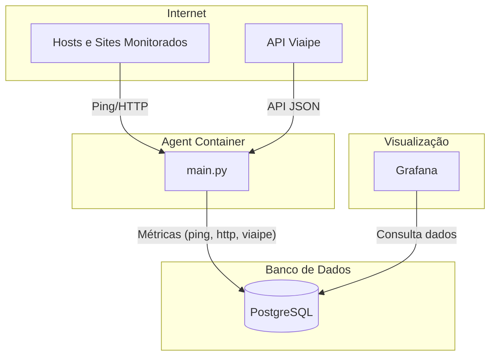

# cronicas-monitor

Projeto DevOps para monitorar latência, disponibilidade e resposta HTTP de sites, com visualização no Grafana e deploy local ou em nuvem.

---

## Índice

- [Descrição](#descrição)
- [Funcionalidades](#funcionalidades)
- [Estrutura do Projeto](#estrutura-do-projeto)
- [Como Executar Localmente](#como-executar-localmente)
- [Monitoramento e Visualização](#monitoramento-e-visualização)
- [Deploy em Nuvem](#deploy-em-nuvem)
- [Automação de Migração (Supabase)](#automação-de-migração-supabase)
- [Licença](#licença)

---

## Descrição

O **cronicas-monitor** é uma solução DevOps para monitoramento de infraestrutura, realizando:
- Ping em hosts configurados
- Checagem HTTP de sites
- Coleta de métricas da API ViaIPE
- Armazenamento dos dados em PostgreSQL
- Visualização dos dados no Grafana

---

## Funcionalidades

- **Monitoramento de Latência e Perda de Pacotes:** via ping em hosts definidos.
- **Monitoramento HTTP:** mede latência e status de resposta de sites.
- **Coleta ViaIPE:** integra com a API ViaIPE para métricas de clientes.
- **Armazenamento:** todas as métricas são salvas em um banco PostgreSQL.
- **Visualização:** dashboards prontos no Grafana.
- **Automação:** deploy local via Docker Compose e migração automática para Supabase via GitHub Actions.

---

## Estrutura do Projeto


Searched cronicas-monitor for "Preciso que crie uma documentaçção em Markdown para a aplicação.", 10 results

```
cronicas-monitor/ 
├── .env # Variáveis de ambiente 
├── docker-compose.yml # Deploy local (Postgres, Grafana, Agent) 
├── docker-compose.cloud.yml # Deploy para nuvem (Supabase) 
├── agent/ 
│ ├── Dockerfile 
│ ├── main.py # Código principal do agente de coleta 
│ └── requirements.txt 
├── db/ 
│ └── init.sql # Script de criação das tabelas 
├── .github.workflows/ 
│ └── db-migration.yml # Workflow de migração para Supabase 
└── README.md
```

---

## Como Executar Localmente

1. **Configure as variáveis de ambiente**

> O arquivo `.env` deverá ser criado na raiz do projeto, abaixo está o conteúdo a ser copiado para o arquivo criado.
```
DB_HOST=localhost
DB_PORT=5432
DB_NAME=cronicas_monitor
DB_USER=postgres
DB_PASSWORD=
POSTGRES_PASSWORD=
```

   Edite o arquivo `.env` e defina:
    - `POSTGRES_PASSWORD` (senha do banco para o container)
    - `DB_PASS` (senha do banco para o agent)

2. **Suba os serviços com Docker Compose**

   ```sh
   docker-compose up --build
   ```

- O banco ficará disponível em localhost:5432
- O Grafana ficará disponível em http://localhost:5000 (ou a porta definida)

3. **Acesse o Grafana**

- Usuário padrão: admin
- Senha padrão: admin (primeiro acesso)

## Monitoramento e Visualização
- O agente (main.py) coleta métricas a cada 60 segundos e armazena no banco.
- O Grafana pode ser configurado para visualizar as tabelas ping, http_check e viaipe.
- O script SQL `init.sql` cria as tabelas necessárias automaticamente.

## Deploy em Nuvem
- Para rodar em nuvem (ex: Supabase), use o arquivo `docker-compose.cloud.yml` e configure as variáveis de ambiente dentro do Github para apontar para o banco remoto.
- O workflow db-migration.yml automatiza a aplicação do script SQL no Supabase a cada alteração em init.sql.

## Automação de Migração (Supabase)
- O workflow GitHub Actions detecta mudanças em init.sql e executa a migração no banco Supabase usando as variáveis de ambiente do repositório (DB_HOST, DB_PORT, DB_USER, DB_PASS, DB_NAME).'

## High Level Design (HLD)



## Licença
MIT